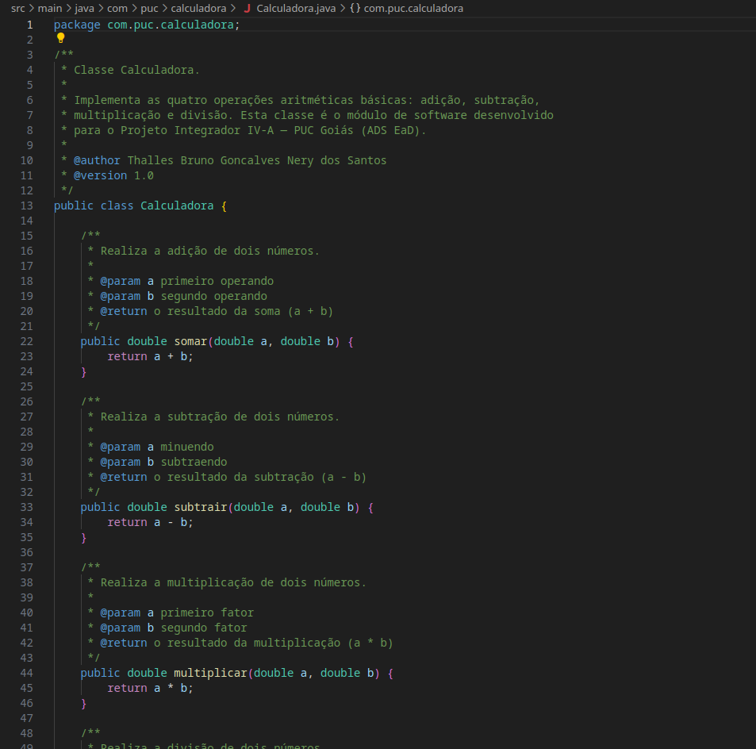
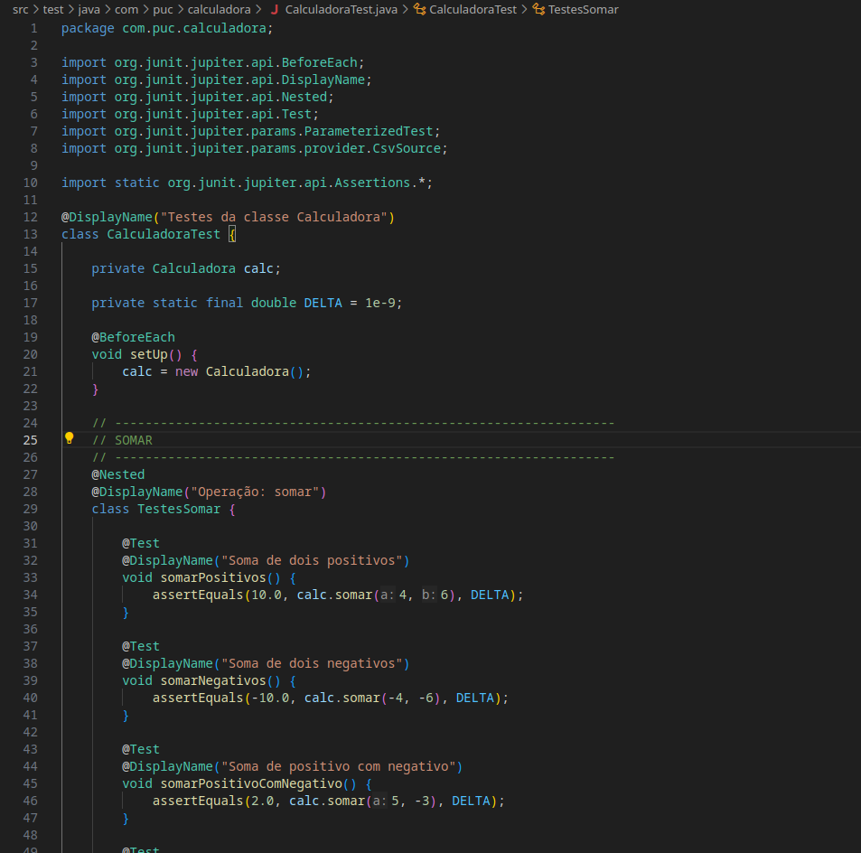
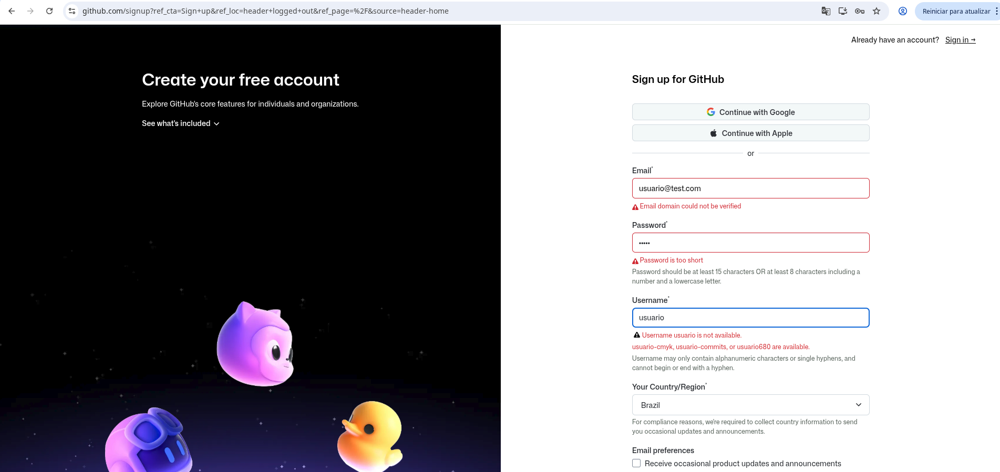
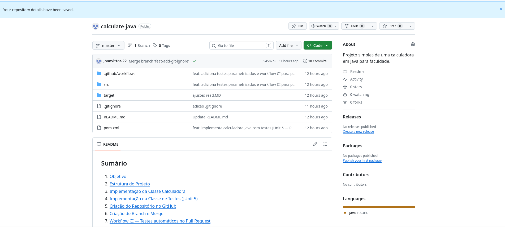
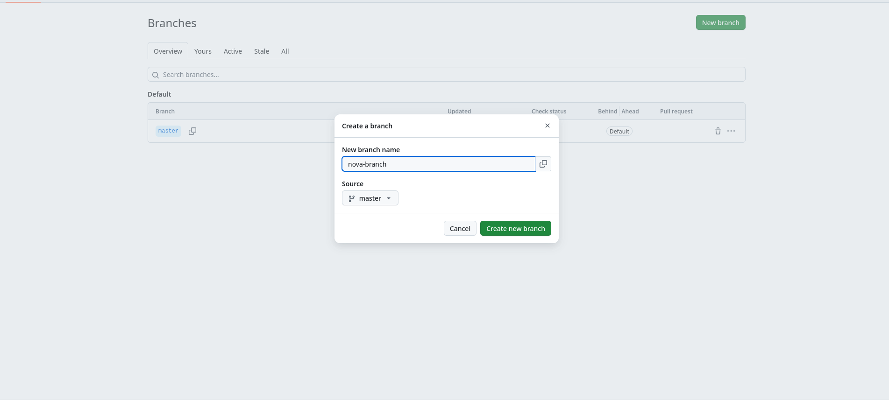
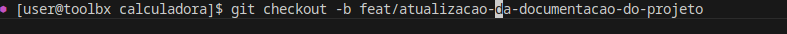
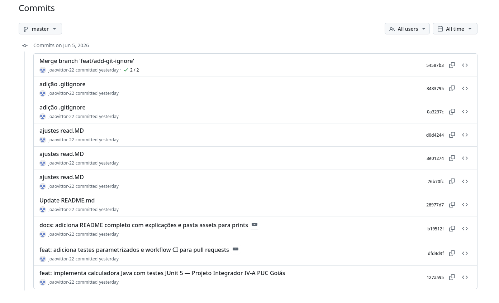
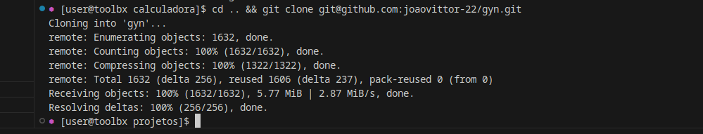
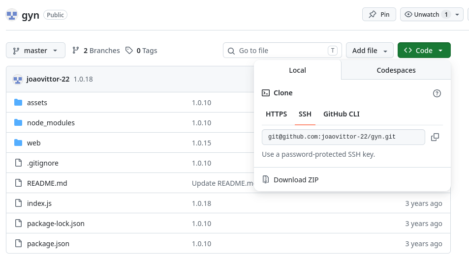

# Anexos — Documentação Visual

Este documento reúne os prints de tela referenciados no [README.md](README.md), organizados por etapa do desenvolvimento.

---

## 1. Implementação da Classe Calculadora

Código-fonte da classe `Calculadora`, com os quatro métodos aritméticos.

---

## 2. Implementação da Classe de Testes

Código-fonte da classe `CalculadoraTest`, com os testes organizados em classes internas (`@Nested`).

---

## 3. Criação de Conta no GitHub

Tela de criação de conta utilizada para configurar o repositório do projeto.

---

## 4. Criação do Repositório no GitHub

Repositório `calculate-java` criado no GitHub, recebendo o código-fonte do projeto.

---

## 5. Criação de Branch

### Via interface do GitHub

### Via linha de comando

---

## 6. Commits e Merge

Histórico de commits e merge da branch de feature na `master`.

---

## 7. Clone de Repositório Existente

Exemplo de clonagem de um repositório já existente via linha de comando.

